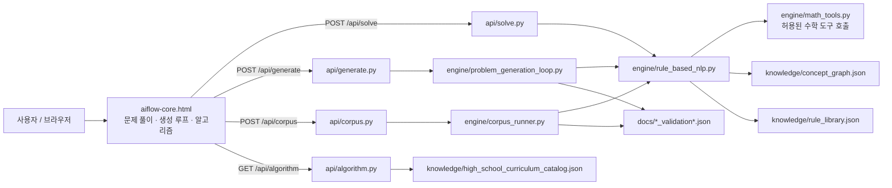

# 시스템 구성도

## 레이어별 책임

| 레이어 | 책임 | 상태 변경 |
| --- | --- | --- |
| UI | 문제 입력, API 호출, trace와 검산 표시 | 없음 |
| API | 요청 크기·형식 제한, UTF-8 JSON 응답 | 없음 |
| Engine | 정규화, 분류, 슬롯 추출, 계산, 검산 | 보고서 저장 시에만 파일 생성 |
| Knowledge | 개념·규칙·과목 카탈로그 제공 | 코드 확장 시 갱신 |
| Benchmark | 기대 정답 비교, 결정성 확인 | UTF-8 JSON 보고서 생성 |

## 배포 경계

`vercel.json`이 `/`를 `aiflow-core.html`로, 네 개의 API 경로를 각 Python Vercel 함수로 연결한다. 각 함수의 최대 실행 시간은 10초 또는 30초이며, 외부 DB·외부 LLM 호출은 없다.
