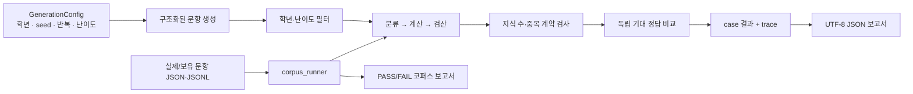

# 생성·코퍼스 검증 플로우

## 난이도 계약

| 난이도 | 공식 지식 수 | 동일 공식 최대 중복 | 현재 실제 구조 |
| --- | ---: | ---: | --- |
| 하 | 1~2 | 1 | 단일 공식형 |
| 중 | 3~5 | 2 | 등차수열 일반항 2회 + 합산 |
| 상 | 6~10 | 3 | 수열 → 함수 대입 → 지수·로그 역연산 |

계약은 임의로 뽑은 공식 목록을 표시하는 방식이 아니다. 각 생성 문항의 실제 `knowledge_ids`와 계산 경로가 정책 범위에 맞는지 검사한다.

## 코퍼스의 역할

생성 문항 통과율은 생성기가 만든 지원 범위의 안정성만 말한다. 실제 문항 일반화는 코퍼스에서 `expected`와 엔진의 `answer`를 비교해 확인한다. 특정 시험 문항의 숫자를 고정한 전용 규칙은 두지 않으며, 실제 문항의 실패 유형은 범용 수학 도구와 일반화된 슬롯으로 확장한다.
