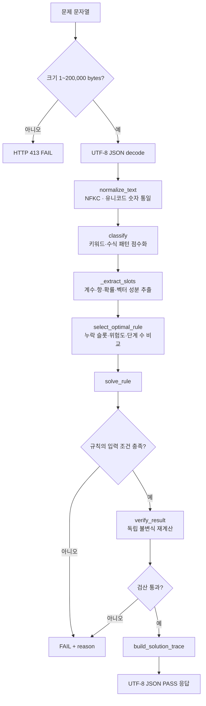

# 문제 풀이 플로우

## 응답 계약

`/api/solve` 응답은 `status`, `parse`, `path`, `result`, `steps`, `summary`를 갖는다.

- `parse`: 정규화 문장, 도메인, 태그, 슬롯, 누락 슬롯, 신뢰도
- `path`: 실제 선택된 규칙 ID
- `result`: 정답, 공식, 검산 결과 또는 실패 이유
- `steps`: 학생에게 보여 줄 순서형 풀이

`Fraction`처럼 기본 JSON이 표현하지 못하는 수학 객체는 정확한 문자열(예: `"1/2"`)로 보존한다.

## 예시: 이항분포

`이항분포 n=5, p=1/2에서 X=2일 확률`은 `stat_binomial_distribution`으로 분류된다. 슬롯 `n=5, p=1/2, k=2`를 추출한 뒤 `nCk·p^k·(1-p)^(n-k)`를 적용하고, 같은 식을 독립 계산해 `0.3125`를 검산한다.
